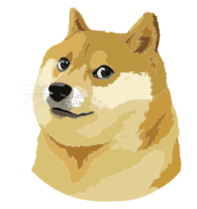

🚧 Still in development. No Guarantees or Warranties. Use at own risk! 🚧
# Dogecoin Core Client 

Dogecoin Core Wallet Client based on React and Electron to enable easy and modern UI for the Core Wallet.

## Application data

* Win: `%APPDATA%\dogecoin-wallet`
* Linux: `$XDG_CONFIG_HOME/dogecoin-wallet` or `~/.config/dogecoin-wallet`
* Mac: `~/Library/Application Support/dogecoin-wallet`

## Config File

The config file `config.json` is located in the application data directory.

### Keys

|Name|Arguments|Default|Description|
|----|---------|-------|-----------|
|windowBounds|width, height|width: 600, height: 400|Width and height of the application's window|
|rpc|mtls, host, port|mtls: false, host: "localhost", port: 22555|RPC parameter to connect to the Core Wallet|

> Note: If `mtls` is set to `true` you need to provide `client.crt`, `ca.crt` and `client.key` in the application data directory

## Dev Notes

* Run `npm install`
* Run `npm run dev` to start the development server

  

